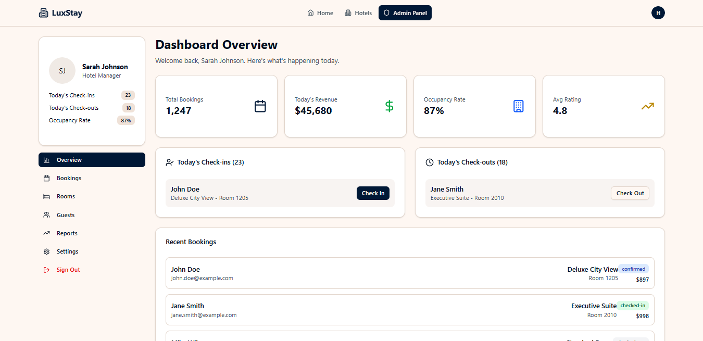
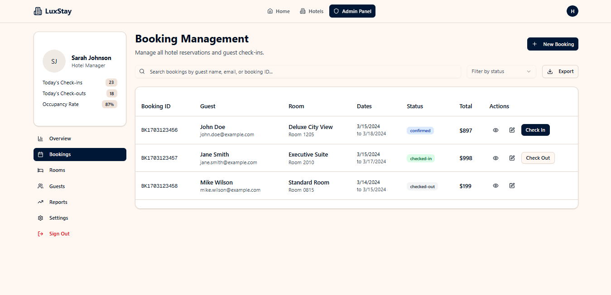
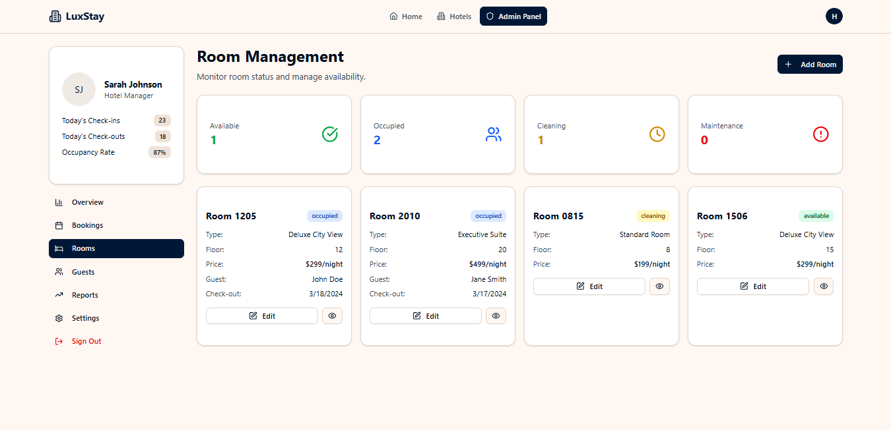
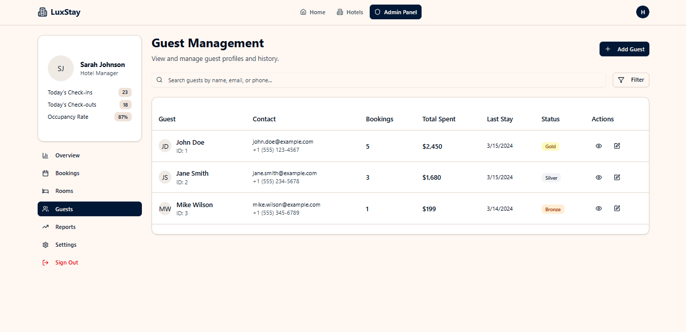
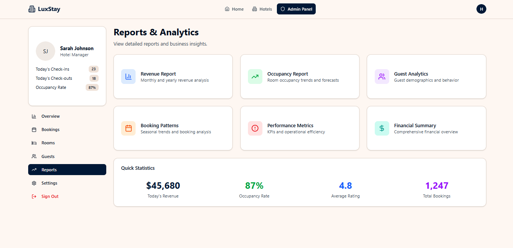
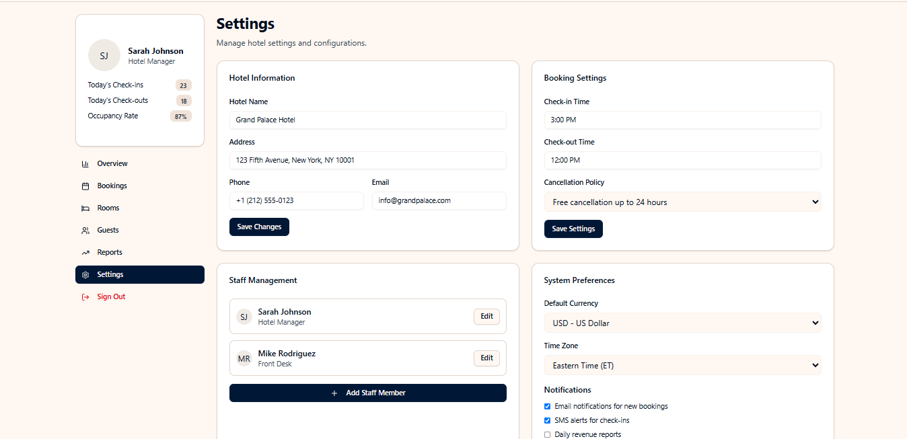

# 🏨 Hotel Reservation System – Frontend Prototype

This repository contains the **frontend prototype** of a Hotel Reservation Management System, built with **Next.js 14 (App Router)** and **TypeScript**.
The project is part of a class activity and is intended **for demonstration purposes only**.

---

## 📌 Overview

The Hotel Reservation System prototype provides a modern, responsive UI for simulating hotel operations, including:

* Browsing hotel branches and rooms
* Guest registration and login
* Creating and managing reservations
* Payment workflow simulation
* Staff dashboard (admin view)

⚠️ **Note**: This prototype focuses on **UI/UX only**. No production backend or database is connected. Data is mocked to illustrate functionality.

---

## 🎨 Features (Prototype)

* 🏢 **Branch & Room Browsing** – View hotels, room types, prices, and availability
* 🙍‍♂️ **Guest Module** – Register, login, and view reservations
* 📅 **Reservation Flow** – Select check-in/check-out dates, room, and confirm booking
* 💳 **Payment Simulation** – Mock payment UI with different methods (card, cash, transfer)
* 👨‍💼 **Staff Dashboard** – Manage rooms, staff, and view reservations (demo view only)
* 📱 **Responsive Design** – Optimized for desktop and mobile

---

## 📸 Feature Showcase

### 1. Dashboard
The central hub displaying hotel performance, quick stats, and shortcuts to main features.  


---

### 2. Booking
Easily manage reservations with check-in/out details, room allocation, and booking status.  


---

### 3. Rooms
View and manage available rooms, their types, capacities, and pricing.  


---

### 4. Guest
Register guests and maintain records including personal information and booking history.  


---

### 5. Reports
Generate operational reports such as revenue, occupancy rates, and guest activity.  


---

### 6. Settings
Configure system preferences including staff management, hotel information, and booking rules.  



---

## ⚙️ Tech Stack

* **Framework**: [Next.js 14 (App Router)](https://nextjs.org/)
* **Language**: TypeScript
* **Styling**: Tailwind CSS
* **UI Components**: Shadcn/UI + Radix Primitives
* **State Management**: React hooks (with mock data layer)

---

## 🚀 Getting Started

### 1. Clone the repository

```bash
git clone https://github.com/nekolaiv/hotel-reservation.git
cd hotel-reservation-system-frontend
```

### 2. Install dependencies

```bash
npm install
# or
yarn install
```

### 3. Run the development server

```bash
npm run dev
# or
yarn dev
```

Then open [http://localhost:3000](http://localhost:3000) to view the prototype in your browser.

---

## 📜 Disclaimer

This project is **for educational purposes only** as part of a class activity.
It is **not open source** and **not intended for production use**.
All features are **mocked frontend representations** of an existing idea.

---

## 👥 Project Team

This project was developed as part of a class activity by:

* **Valeros, Vladimir** 
* **Idulsa, Emman Nicholas** 
* **Amin, Ionyjal** 
* **Bakaun, Edris**
